# Part 5f: Building a SoC platform for the Vitis Unified backend

This guide shows how to create a platform (XSA file) in Vivado and how to add a new board to the hls4ml `VitisUnified` backend.

The backend already ships platforms for the **zcu102** and **kv260**, so Parts 5a-5e work out of the box on those boards. You need this guide when:

- you use another board,
- you use another Vivado version, or
- you want to change the system design for your own workload.

## What the platform must contain

The platform is the hardware skeleton of the system: the processing system (PS), the AXI interconnect, the interrupt controller, and the DMA. The backend links the hls4ml kernel into your platform with `v++`, and the PYNQ driver expects a few fixed names. Your block design must have:

| Item | Requirement |
|------|-------------|
| Project | **Project is extensible to Vitis platform** must be enabled |
| Block design name | **`vitis_design`** (the backend copies `vitis_design.hwh` after linking) |
| Processing system | Zynq / Zynq UltraScale+ PS with DDR enabled |
| AXI master port from the PS | for the kernel control registers (AXI-Lite), exposed in Platform Setup |
| AXI slave port to the PS memory | for the kernel data (`axi_master` mode) or the DMA (`axi_stream` mode), exposed in Platform Setup |
| Clock | one clock exposed in Platform Setup and marked as default |
| Interrupt | an AXI interrupt controller (`axi_intc`) connected to the PS, exposed in Platform Setup |
| AXI DMA (`axi_stream` mode only) | one `axi_dma` block named **`axi_dma_0`**, its `s2mm_introut` connected to the interrupt controller, and its stream ports exposed in Platform Setup |

Reference designs are in `hls4ml/templates/vitis_unified/<board>/tcl_scripts/` in the hls4ml repository.

## 1. Create a Vivado project

Create a normal Vivado project for your board, but you MUST tick **Project is extensible to Vitis platform**.

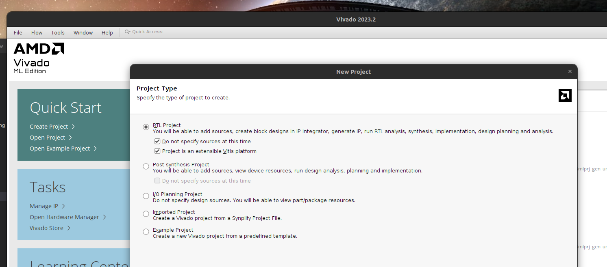

## 2. Create the block design

The block design name MUST be `vitis_design`.

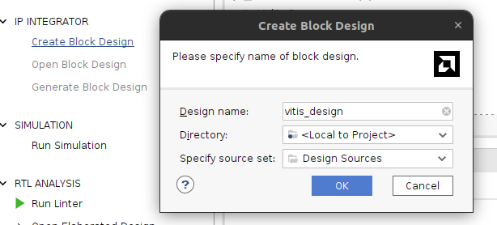

## 3. Build the block design

The block design should look like this picture.

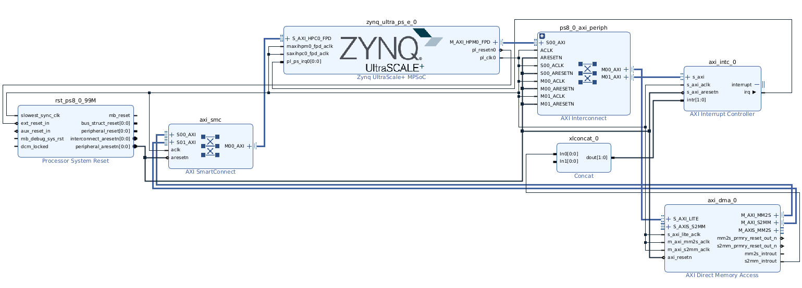

## 4. Platform setup

Open the **Platform Setup** tab and enable the ports that `v++` may use.

- AXI ports

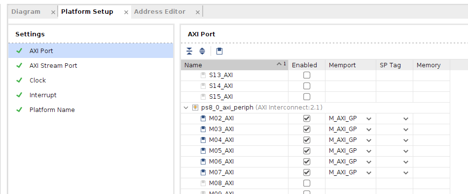
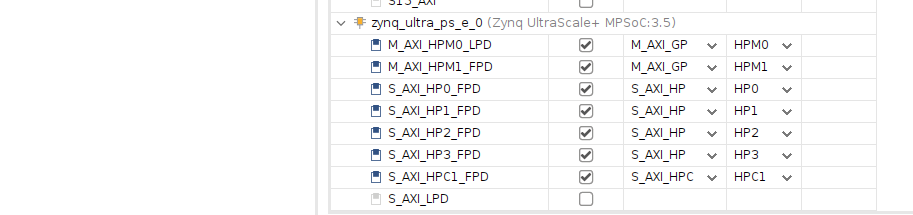

- AXI-Stream ports (`axi_stream` mode only)

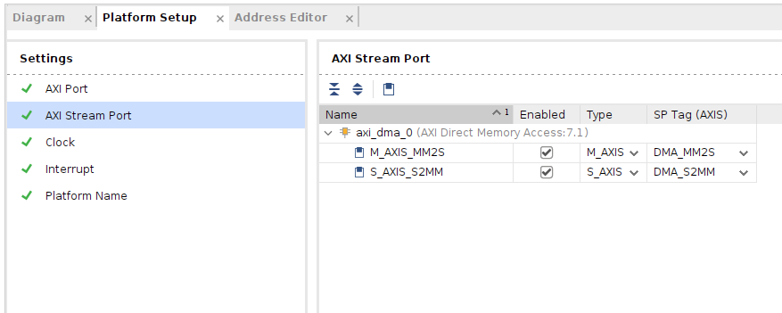

- Clock

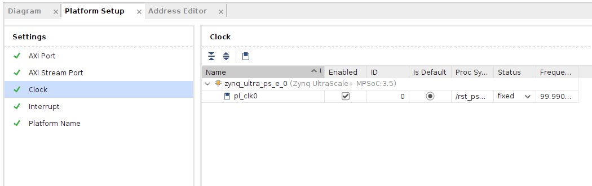

- Interrupt

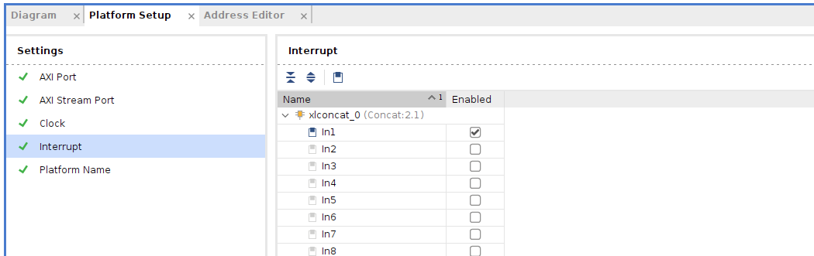

## 5. Create the HDL wrapper and generate output products

Right-click the block design, choose **Create HDL Wrapper**, then **Generate Output Products**.

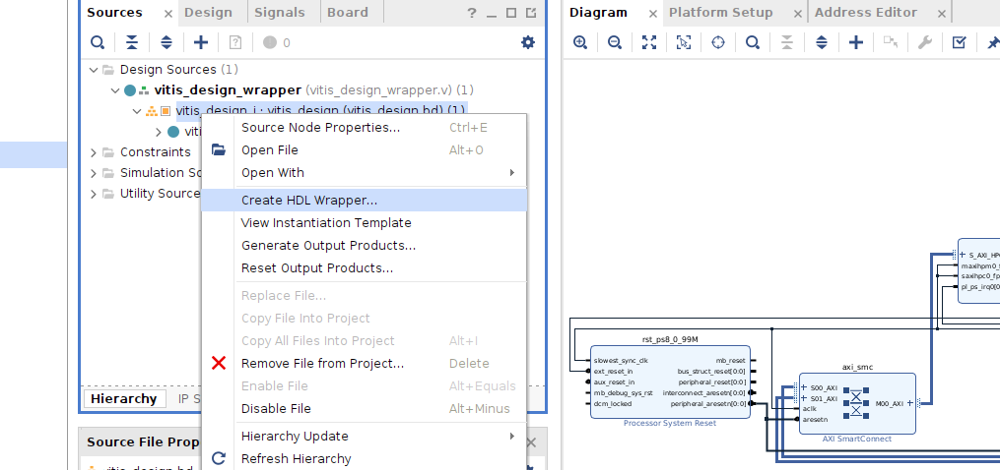

## 6. Generate the bitstream

Run **Generate Bitstream** once, so that Vivado checks the design.

## 7. Export the platform

### 7.1 Check for a DCP file

If a DCP file exists under `utils_1`, you MUST delete it before the next step.

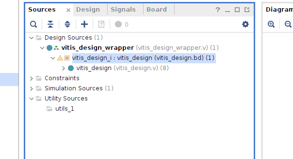

### 7.2 Export

Choose **File > Export > Export Platform** and follow the wizard. It writes the XSA file to the folder you choose.
The XSA file can be used in place of an XPFM file.

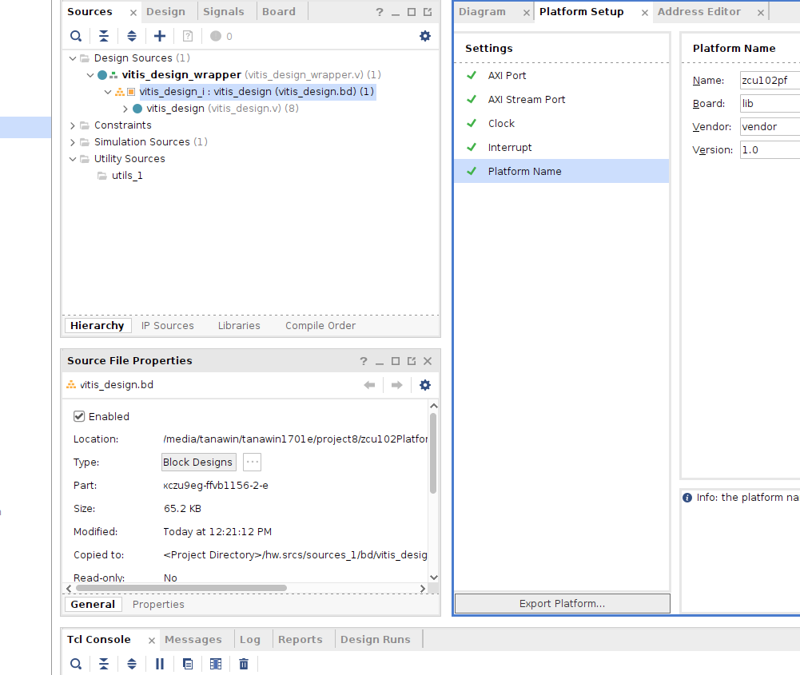

## 8. Add the board to the hls4ml backend

The backend finds the platform only through `hls4ml/backends/vitis_unified/supported_boards.json`.
There is no option to pass a platform path from Python, so you must add a board entry.
Choose one of the two ways below. In both cases `<board>` is the name you will pass as `board='<board>'`.

### 8.1 Create the board folder

Copy the driver templates from an existing board:

```bash
cd hls4ml/templates/vitis_unified
mkdir -p <board>/python_drivers
cp kv260/python_drivers/*.hls4ml <board>/python_drivers/
```

The drivers work without changes as long as your platform follows the table in "What the platform must contain".

### 8.2 Way A: use the exported XSA file directly

Add this entry to `supported_boards.json`. Use an **absolute path** to your XSA (a relative path is resolved from `$XILINX_VITIS`).
Do not add `platform_generator_tcl`; if it exists, the backend uses it instead of `platform_file`.

```json
"<board>": {
  "part": "<fpga part, for example xczu9eg-ffvb1156-2-e>",
  "axi_master": {
    "platform_file": "/absolute/path/to/<board>_platform.xsa",
    "python_driver": "axi_master_driver.py",
    "c_drivers": ""
  },
  "axi_stream": {
    "platform_file": "/absolute/path/to/<board>_platform.xsa",
    "python_driver": "axi_stream_driver.py",
    "c_drivers": ""
  }
}
```

An XPFM file from AMD works the same way; see the `zcu102` `axi_master` entry.

### 8.3 Way B: let the backend build the XSA from a Tcl script

This is how the shipped boards work. The backend copies `<board>/tcl_scripts/` into the project and runs Vivado in batch mode
when the XSA is missing or older than the script.

1. In Vivado, export your block design: **File > Export > Export Block Design** (or `write_bd_tcl`).
   Save it as `hls4ml/templates/vitis_unified/<board>/tcl_scripts/<board>_platform_<vivado version>.tcl`.
2. Copy `kv260/tcl_scripts/create_xsa.tcl` to `<board>/tcl_scripts/create_xsa.tcl` and edit the file name pattern,
   the supported Vivado versions, and the output XSA name at the top of the script.
3. Add this entry to `supported_boards.json`:

```json
"<board>": {
  "part": "<fpga part>",
  "axi_master": {
    "platform_generator_tcl": "<board>/tcl_scripts/create_xsa.tcl",
    "platform_output": "<board>/tcl_scripts/output/<board>_platform.xsa",
    "python_driver": "axi_master_driver.py",
    "c_drivers": ""
  },
  "axi_stream": {
    "platform_generator_tcl": "<board>/tcl_scripts/create_xsa.tcl",
    "platform_output": "<board>/tcl_scripts/output/<board>_platform.xsa",
    "python_driver": "axi_stream_driver.py",
    "c_drivers": ""
  }
}
```

Both paths are relative to `vitis_workspace/` inside the generated project.

### 8.4 Install and use

If you installed hls4ml with `pip install .`, run it again so the new board folder and `supported_boards.json` are copied.
An editable install (`pip install -e .`) picks up the change directly.

```python
hls_model = hls4ml.converters.convert_from_keras_model(
    model,
    hls_config=config,
    output_dir='hls4ml_prj',
    backend='VitisUnified',
    board='<board>',
    axi_mode='axi_master',
)
hls_model.compile()
hls_model.build(synth=True, bitfile=True)
```

The bitstream, the hardware handoff, and the Python driver are written to `hls4ml_prj/export/`.

## Quick fix without changing hls4ml

If you only want to try your XSA once, build the project for a shipped board (for example `kv260`) and, after `compile()`,
copy your XSA over the generated one with the same name:

```bash
cp my_platform.xsa hls4ml_prj/vitis_workspace/kv260/tcl_scripts/output/kv260_axi_all_platform.xsa
```

`link_system.sh` rebuilds the XSA only when it is missing or older than `create_xsa.tcl`, so your file is used as it is.
Use plain `cp` (not `cp -p`) so the file gets a new timestamp.
